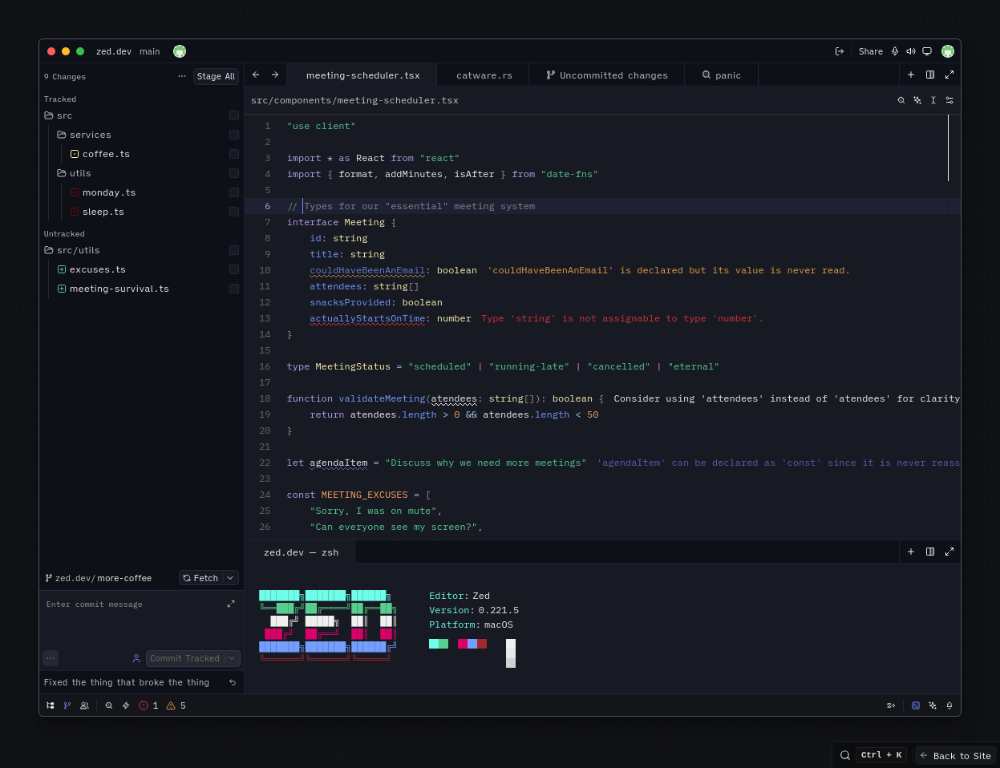
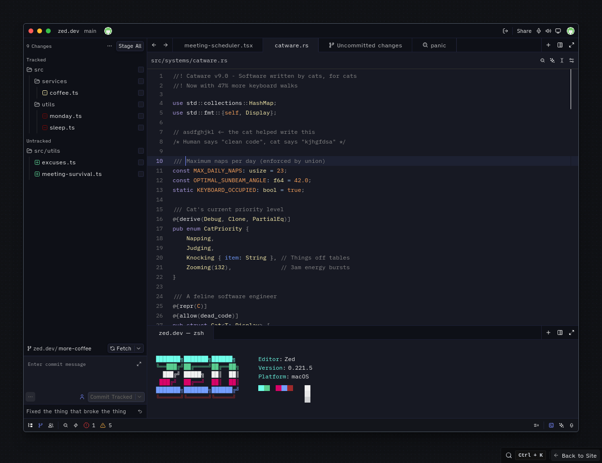
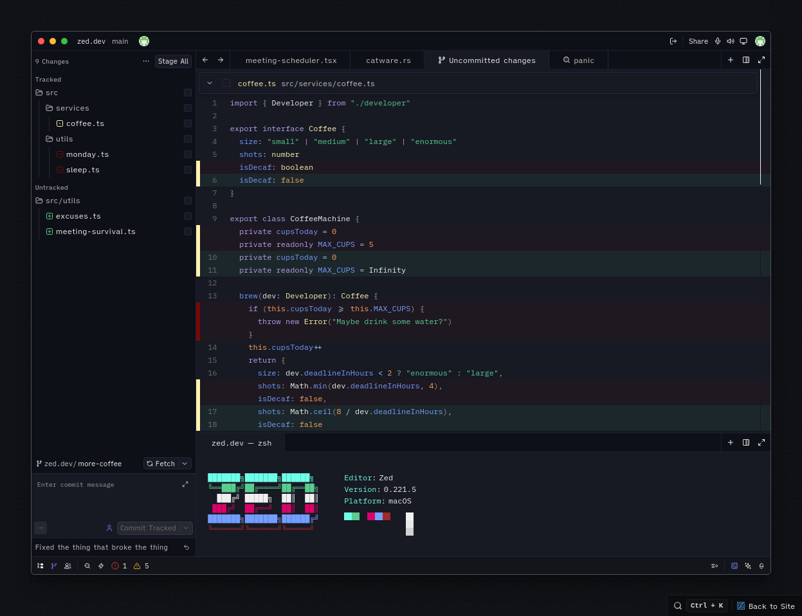
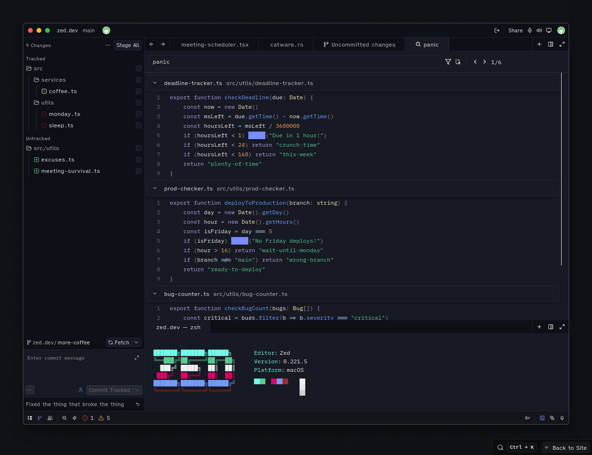

# Nyx Theme for Zed

A theme for [Zed](https://zed.dev) inspired by Nyx, the goddess of the night.

## Screenshots

## Installation

- Copy the `nyx.json` file from the `nyx/themes` folder in this repository into `~/.config/zed/themes`.
- Select the theme via Settings → Select Theme.

## Customization

You're welcome to customize the theme by importing the `nyx.json` file into the [Zed Theme Builder](https://zed.dev/theme-builder). If you publish your version, please credit the original by linking to this repository or the official theme page.
